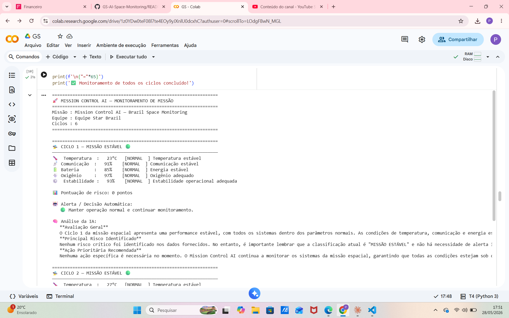
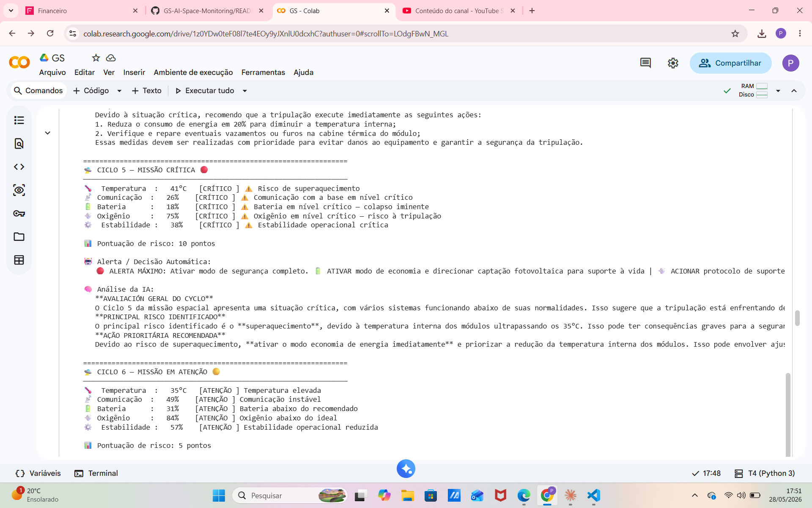
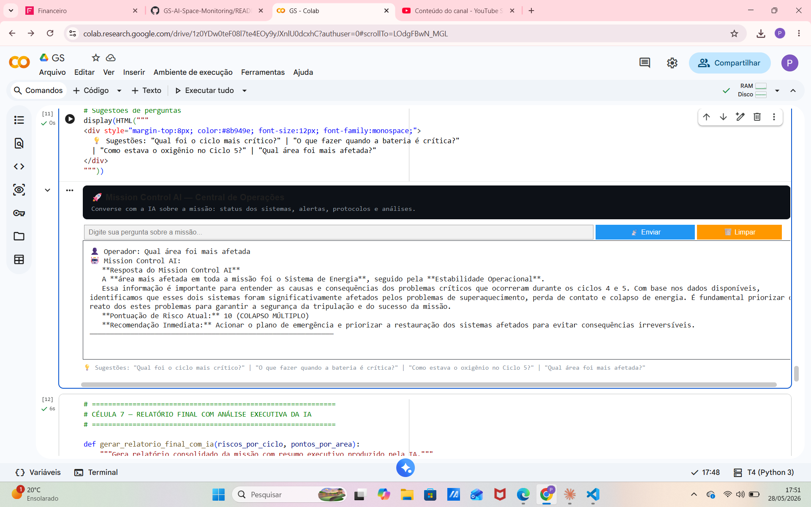
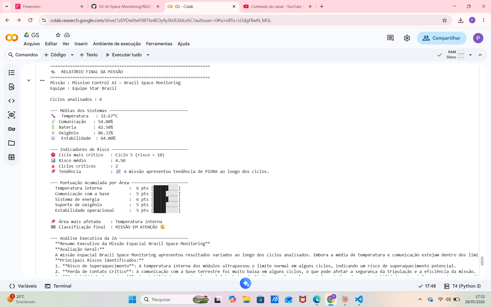

# Mission Control AI — Brazil Space Monitoring

**FIAP — Global Solution 2026.1 | Prompt and Artificial Intelligence**
* **Prof. Hercules Ramos** | Período: 1º Semestre de 2026
* **Curso:** Ciência da Computação - 1º Ano

---

### Integrantes
* **Luan de Araujo Carneiro** — RM 573691
* **Pedro Sampaio Mochnacs Arruda** — RM 573522
* **Raul Sampaio Mochnacs Arruda** — RM 573523

---

## Sobre o Projeto
Mission Control AI é um sistema inteligente de monitoramento e controle de missão espacial experimental desenvolvido em Python com integração de IA generativa (modelo Llama 3.2 via Ollama).

O sistema recebe, interpreta e exibe dados simulados de 6 ciclos operacionais da missão, monitorando 5 sistemas críticos:
* Temperatura interna dos módulos
* Comunicação com a base terrestre
* Energia (nível de bateria / geração solar)
* Oxigênio (suporte de vida)
* Estabilidade operacional geral

A IA analisa cada ciclo individualmente, identifica riscos, dispara alertas automáticos com lógica de decisão estruturada e gera um relatório executivo final com recomendações.

---

## Como a IA está integrada
O sistema utiliza o modelo Llama 3.2 rodando localmente via Ollama no Google Colab, aplicando as seguintes técnicas:

| Técnica | Aplicação |
| :--- | :--- |
| **System Prompt** | Contexto completo da missão espacial, parâmetros normais e protocolos de emergência. |
| **RAG (Retrieval Augmented Generation)** | Base de conhecimento com 13 documentos indexados sobre os ciclos e protocolos da missão. |
| **Histórico de Chat** | Manutenção do contexto conversacional entre turnos do operador. |
| **Análise por Ciclo** | A IA avalia cada ciclo individualmente e retorna análise + ação prioritária. |
| **Resumo Executivo** | A IA gera relatório final consolidado com riscos e recomendações. |

---

## Funcionalidades Implementadas

* **Monitoramento de 5 parâmetros:** Cada parâmetro possui classificação em 3 níveis (NORMAL, ATENÇÃO e CRÍTICO), com pontuação de risco acumulada por ciclo.
* **Alertas automáticos:** Geração de alertas quando parâmetros ultrapassam os limiares críticos:
  * Temperatura > 35°C → Risco de superaquecimento.
  * Comunicação < 30% → Perda de contato crítica.
  * Bateria < 20% → Colapso de energia iminente.
  * Oxigênio < 80% → Risco para a tripulação.
  * Estabilidade < 40% → Instabilidade operacional crítica.
* **Lógica de tomada de decisão:**
  * Se bateria < 20% → ATIVAR modo de economia + captação fotovoltaica.
  * Se oxigênio < 80% → ACIONAR protocolo de suporte à vida.
  * Se comunicação < 30% → TENTAR restabelecer via antena de backup.
  * Se temperatura crítica → ATIVAR controle térmico dos módulos.
  * Se 3+ sistemas críticos → MODO DE SEGURANÇA MÁXIMO.
* **Resposta automatizada para situações críticas:** No Ciclo 5 (colapso múltiplo), o sistema dispara ALERTA MÁXIMO e aciona todos os protocolos simultaneamente.
* **Interface conversacional (ipywidgets):** Chat interativo onde o operador pode consultar status de qualquer sistema, histórico de ciclos e protocolos.
* **Bateria de testes automatizados:** 8 casos de teste com exportação dos resultados em JSON.
* **Relatório final com IA:** Relatório consolidado com médias, indicadores de risco e análise executiva da IA.

---

## Demonstração (Prints do Sistema)

Abaixo estão as capturas de tela do painel de monitoramento e controle operando em tempo real:

### Ciclo Estável (Ciclo 1)

### Alerta Crítico (Ciclo 5 — Colapso Múltiplo)

### Interface de Chat Conversacional

### Relatório Final Gerado com IA

---

## Tecnologias Utilizadas

| Tecnologia | Versão | Uso |
| :--- | :--- | :--- |
| **Python** | 3.10 | Linguagem principal do ecossistema do projeto. |
| **Ollama** | latest | Servidor local para rodar modelos de IA abertos no Colab. |
| **Llama 3.2** | 3B | Modelo de linguagem responsável pelas análises e relatórios. |
| **ipywidgets** | latest | Construção da interface de chat interativa e dinâmica. |
| **Google Colab** | — | Ambiente de execução em nuvem baseado em notebooks. |
| **JSON** | — | Formato para exportação e armazenamento dos logs de testes. |

---

## Como Executar

O projeto roda 100% no Google Colab, sem necessidade de instalar dependências locais em sua máquina.

1. Clique no link abaixo para abrir o ambiente de desenvolvimento:

   https://colab.research.google.com/drive/1z0YDw0teF08l7te4EOy9yJXnlU0dcxhC?authuser=0#scrollTo=92K2aZLF-Ze1

2. No menu do Colab, clique em **Ambiente de Execução** > **Executar tudo** (ou utilize o atalho `Ctrl + F9`). O script seguirá a seguinte ordem de execução estruturada:

* **Célula 1:** Instala o Ollama e realiza o download do modelo Llama 3.2 (pode levar cerca de 2 a 3 minutos).
* **Célula 2:** Configura os parâmetros iniciais da missão e injeta os dados simulados.
* **Célula 3:** Carrega as funções matemáticas de análise e os gatilhos lógicos de decisão.
* **Célula 4:** Inicializa as configurações da IA (System Prompt, carregamento do RAG e histórico).
* **Célula 5:** Dispara o monitoramento automatizado dos 6 ciclos exibindo os dados e os pareceres da IA.
* **Célula 6:** Instancia a interface gráfica interativa do terminal via Widgets.
* **Célula 7:** Executa a suíte de testes automatizados e gera o arquivo de saída em formato JSON.
* **Célula 8:** Consolida os dados no relatório executivo final usando IA generativa.

> **Nota:** Certifique-se de que a Célula 1 terminou por completo o download de ~2GB do modelo antes de tentar realizar chamadas de chat manuais.

---

## Vídeo de Demonstração

Assista ao vídeo explicativo de até 3 minutos apresentando o projeto completo, a defesa do time e o sistema em pleno funcionamento:

[Assistir ao Vídeo de Demonstração](https://SEU_LINK_DO_VIDEO_AQUI)

---
*Desenvolvido para a Global Solution FIAP.*
